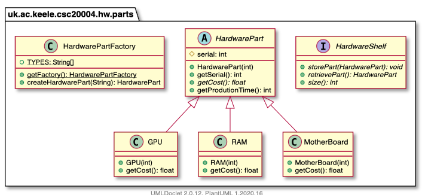
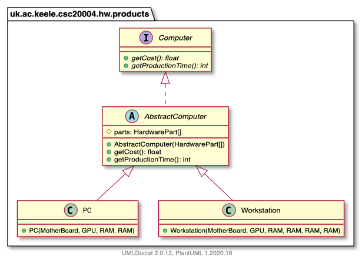

# CSC-20004 - Coursework

This is the starting code for the coursework of module CSC-20004 Advanced Programming practices.

Please refer to the text of the coursework, available on KLE, for an explanation of the code and the instructions for submission. Make sure to check for the deadline on KLE.

The hierarchy of the provided classes for the hardware components is reported here:

The hierarchy relative to the Computer products is reported here:

